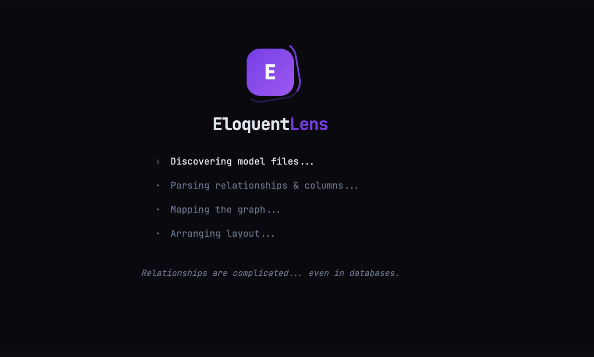
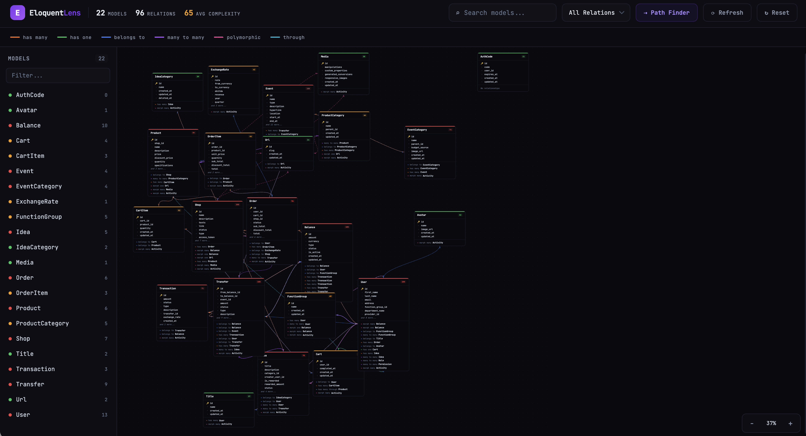
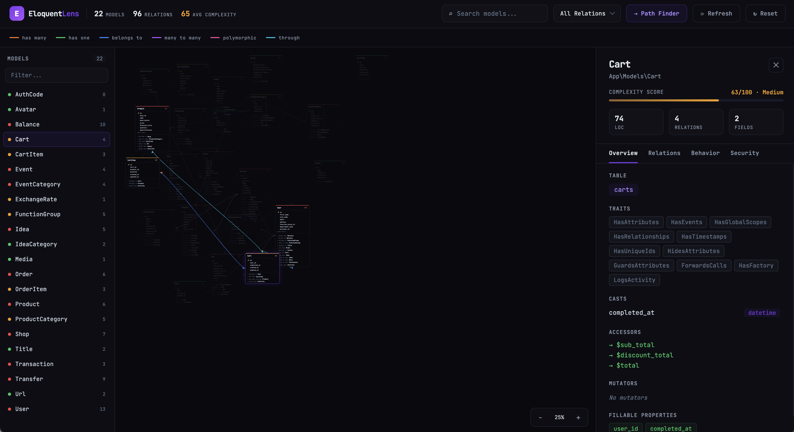
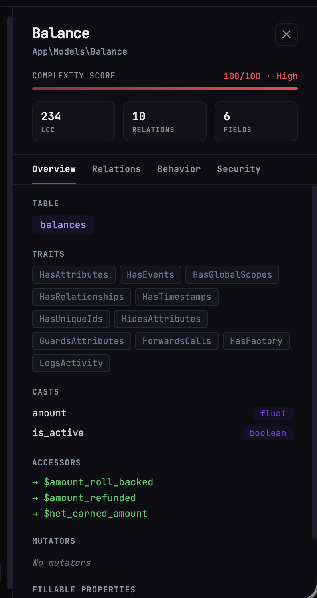
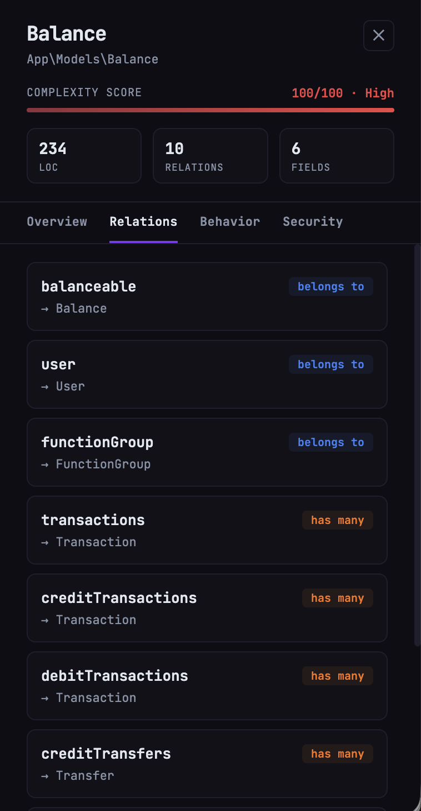
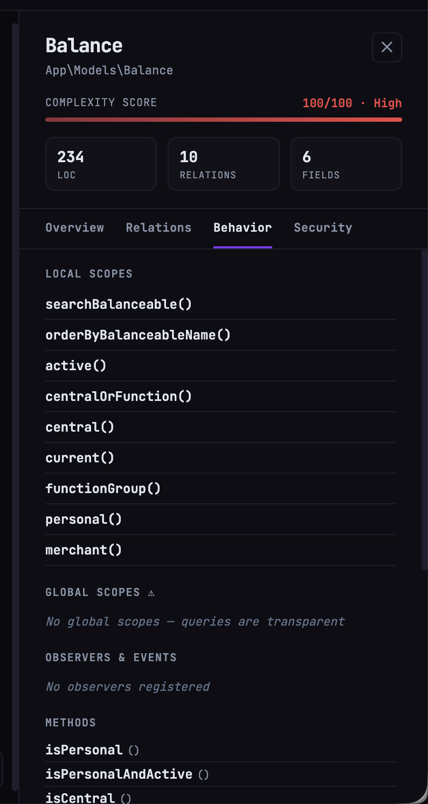
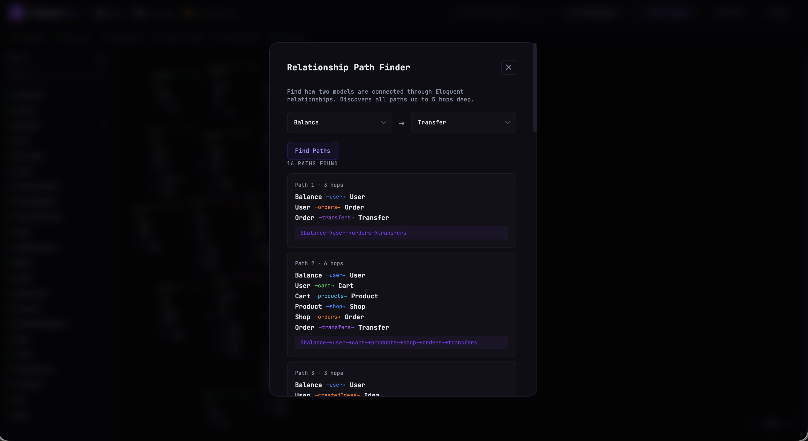

<p align="center">
  
</p>

<h1 align="center">EloquentLens</h1>

<p align="center">
  A visual dashboard for your Laravel Eloquent models.<br>
  Relationships, scopes, casts, policies, complexity — all at a glance. No database queries.
</p>

<p align="center">
  <a href="https://packagist.org/packages/khomerikik/eloquent-lens"></a>
  <a href="https://packagist.org/packages/khomerikik/eloquent-lens"></a>
  
  
  
</p>

---

## Install

```bash
composer require khomerikik/eloquent-lens --dev
php artisan eloquent-lens:install
```

Add to your `.env` to enable the dashboard:

```env
ELOQUENT_LENS_ENABLED=true
```

Then open `/eloquent-lens` in your browser.

> **Dev only** — install with `--dev`. The dashboard is disabled by default and must be explicitly enabled.

## Config

Published to `config/eloquent-lens.php` after running `eloquent-lens:install`:

| Option | Default | Description |
|---|---|---|
| `path` | `'eloquent-lens'` | URL prefix — dashboard is available at `/{path}` |
| `middleware` | `['web']` | Route middleware — add `'auth'` to restrict access |
| `model_paths` | `[app_path('Models')]` | Directories to scan for model files |
| `model_namespace` | `'App\\Models'` | Base namespace for your models |
| `excluded_models` | `[]` | Model classes to skip during scanning |
| `enabled` | `false` | Disabled by default — set `ELOQUENT_LENS_ENABLED=true` in `.env` to enable |

---

## The Board

All your models laid out as cards, connected by relationship lines. Drag, zoom, filter by type.

<p align="center">
  
</p>

---

## Detail Panel

Click any model to open a side panel with four tabs:

<p align="center">
  
</p>

<details>
<summary><strong>Overview</strong> — traits, casts, accessors, fillable fields, complexity score</summary>
<br>
<p align="center">
  
</p>
</details>

<details>
<summary><strong>Relations</strong> — every relationship with its type and target model</summary>
<br>
<p align="center">
  
</p>
</details>

<details>
<summary><strong>Behavior</strong> — local scopes, global scopes, observers, custom methods</summary>
<br>
<p align="center">
  
</p>
</details>

---

## Path Finder

Pick two models and discover how they connect through relationships, up to 5 hops deep.

<p align="center">
  
</p>

---

## Requirements

- PHP 8.1+
- Laravel 10, 11, or 12

## License

MIT
